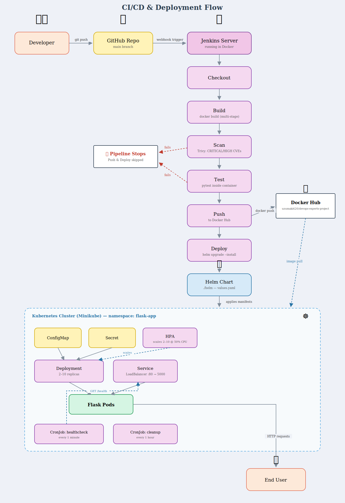

# DevOps Experts Project

A Python Flask web application containerized with Docker, deployed on Kubernetes using raw manifests and a Helm chart, and automated through a Jenkins CI/CD pipeline running inside Docker.

> **Windows users:** Most commands in this guide use Bash syntax. On Windows, use [Git Bash](https://gitforwindows.org/) or [WSL2](https://learn.microsoft.com/en-us/windows/wsl/install) to run them as-is. Windows-specific alternatives are noted inline where the commands differ meaningfully.

---

## End-to-End Flow



---

## Project Structure

```
final-project/
├── app.py                        # Flask application
├── requirements.txt              # Python dependencies
├── Dockerfile                    # Docker image definition
├── docker-compose.yml            # Local development setup
├── Jenkinsfile                   # CI/CD pipeline definition
├── tests/
│   ├── conftest.py               # Pytest path configuration
│   └── test_app.py               # Endpoint tests
├── k8s/                          # Raw Kubernetes manifests
│   ├── configmap.yaml
│   ├── deployment.yaml
│   ├── service.yaml
│   ├── hpa.yaml
│   ├── secret.yaml.example
│   ├── cronjob-healthcheck.yaml
│   └── cronjob-cleanup.yaml
├── helm/                         # Helm chart
│   ├── Chart.yaml
│   ├── values.yaml
│   └── templates/
│       ├── configmap.yaml
│       ├── deployment.yaml
│       ├── service.yaml
│       ├── hpa.yaml
│       ├── secret.yaml
│       ├── cronjob-healthcheck.yaml
│       └── cronjob-cleanup.yaml
└── jenkins/                      # Jenkins Docker setup
    ├── Dockerfile
    └── docker-compose.yml
```


---

## Application

The Flask app binds to `0.0.0.0` so it is reachable from outside the container. Debug mode is controlled by the `FLASK_DEBUG` environment variable so it can be toggled without code changes.

### Endpoints

| Endpoint | Method | Response |
|----------|--------|----------|
| `/` | GET | `{"message": "Hello, Doron!"}` |
| `/health` | GET | `{"status": "healthy"}` |
| `/version` | GET | `{"version": "1.0.0"}` |

The `/health` endpoint is used by Kubernetes liveness and readiness probes. The `/version` endpoint reads `APP_VERSION` from the environment, injected via ConfigMap.

Docker Hub image: **`uzumaki420/devops-experts-project:latest`**

---

## Part 1 — Docker

### Prerequisites
- [Docker Desktop](https://www.docker.com/products/docker-desktop) — available for macOS, Windows, and Linux

### Run with Docker Compose
```bash
docker-compose up
```
Enable debug mode:
```bash
# macOS / Linux / Git Bash
FLASK_DEBUG=true docker-compose up
```
```powershell
# Windows PowerShell
$env:FLASK_DEBUG="true"; docker-compose up
```
Tear down:
```bash
docker-compose down
```

### Build and run manually
```bash
docker build -t devops-experts-project .
docker run -p 5001:5000 devops-experts-project
# Visit: http://localhost:5001
```

### Pull and run from Docker Hub
```bash
docker run -p 5001:5000 uzumaki420/devops-experts-project:latest
```

### Push a new image to Docker Hub
```bash
docker login
docker build -t uzumaki420/devops-experts-project:latest .
docker push uzumaki420/devops-experts-project:latest
```

### Run tests
```bash
pip install -r requirements.txt
pytest tests/ -v
```

### Dockerfile design decisions
- **Multi-stage build** — a `builder` stage installs dependencies, the final stage copies only the installed packages. Build tools (`pip`, `setuptools`, `wheel`) are stripped from the final image, eliminating their CVEs from Trivy scans
- **`pip install --target=/install`** — installs packages into an isolated directory so only the app's runtime dependencies are copied into the final image, not the base image's pre-installed build tools
- **`RUN pip uninstall -y setuptools wheel`** — explicitly removes vulnerable build tools that `python:3.11-slim` ships with, since they are not needed at runtime
- **`python:3.11-slim`** base image keeps the final image small
- Dependencies are installed before copying app code so Docker can cache the `pip install` layer and skip it on every code change
- Files are copied explicitly (`COPY app.py .`) rather than using `COPY . .` to avoid accidentally including sensitive or unnecessary files in the image

---

## Part 2 — Kubernetes with Minikube

### Prerequisites
- [Minikube](https://minikube.sigs.k8s.io/docs/start/)
  - macOS: `brew install minikube`
  - Windows: `winget install Kubernetes.minikube` or `choco install minikube`
  - Linux: see [minikube docs](https://minikube.sigs.k8s.io/docs/start/)
- [kubectl](https://kubernetes.io/docs/tasks/tools/)
  - macOS: `brew install kubectl`
  - Windows: `winget install Kubernetes.kubectl` or `choco install kubernetes-cli`
  - Linux: see [kubectl docs](https://kubernetes.io/docs/tasks/tools/install-kubectl-linux/)

### Start the cluster
```bash
minikube start --driver=docker
```
The `--driver=docker` flag runs the Minikube node inside a Docker container rather than a VM.

### Enable the Metrics Server
Required for the HPA to read CPU utilisation. Without it, `kubectl get hpa` shows `<unknown>` as the current CPU value.
```bash
minikube addons enable metrics-server
```

### Verify the cluster
```bash
minikube status
kubectl get nodes
# Expected: one node named 'minikube' with status Ready
```

### Create the secret
`secret.yaml` is intentionally excluded from git. Secrets committed to a repository live in the commit history permanently and can be extracted even after deletion.

Generate a base64-encoded key and create the file:
```bash
# macOS / Linux / Git Bash
python3 -c "import secrets, base64; print(base64.b64encode(secrets.token_hex(32).encode()).decode())"
cp k8s/secret.yaml.example k8s/secret.yaml
# Edit k8s/secret.yaml and replace <base64-encoded-value> with the generated output
```
```powershell
# Windows PowerShell (python3 may be python or py depending on your install)
python -c "import secrets, base64; print(base64.b64encode(secrets.token_hex(32).encode()).decode())"
copy k8s\secret.yaml.example k8s\secret.yaml
# Edit k8s\secret.yaml and replace <base64-encoded-value> with the generated output
```

### Deploy — apply in this order
Each resource must exist before the ones that reference it:
```bash
kubectl apply -f k8s/configmap.yaml
kubectl apply -f k8s/secret.yaml
kubectl apply -f k8s/deployment.yaml
kubectl apply -f k8s/service.yaml
kubectl apply -f k8s/hpa.yaml
kubectl apply -f k8s/cronjob-healthcheck.yaml
kubectl apply -f k8s/cronjob-cleanup.yaml
```

Verify:
```bash
kubectl get pods
kubectl get services
kubectl get hpa
kubectl get cronjobs
```

### Manifest overview

**`configmap.yaml`** — stores non-sensitive environment variables (`FLASK_DEBUG`, `APP_NAME`, `APP_VERSION`) injected into every pod via `envFrom`.

**`deployment.yaml`** — manages the Flask pods. Runs 2 replicas by default. Includes:
- **Liveness probe** — checks `/health` every 10s. Restarts the pod after 3 consecutive failures
- **Readiness probe** — checks `/health` every 5s. Removes the pod from the load balancer without restarting after 3 failures
- **CPU requests/limits** — `100m` request, `200m` limit. Required for the HPA to calculate utilisation percentages

**`service.yaml`** — exposes the app as a `LoadBalancer` on port 80, forwarding to port 5000 on the pods.

**`hpa.yaml`** — automatically scales pods between 2 and 10 when average CPU across all pods exceeds 50% of their requested CPU.

**`cronjob-healthcheck.yaml`** — runs every minute, hits the service endpoint and verifies the response contains `Hello, Doron!`. Exits with code 1 on failure so Kubernetes marks the job as failed.

**`cronjob-cleanup.yaml`** — runs every hour, clears `/tmp` inside a busybox container.

### Access the app (macOS and Windows with Docker driver)
On macOS and Windows, LoadBalancer services need a tunnel to get an external IP:
```bash
# Run in a separate terminal — keep it open
minikube tunnel
# App is now available at:
curl http://127.0.0.1:80
curl http://127.0.0.1:80/health
curl http://127.0.0.1:80/version
```

### Verify individual components
```bash
kubectl describe pod <pod-name>     # events, probes, env vars
kubectl get hpa                      # autoscaler status and current CPU
kubectl top pods                     # live CPU and memory usage
kubectl get pods -w                  # watch pods scale in real time
kubectl get jobs                     # completed CronJob runs
kubectl logs -l app=flask-app        # logs from all pods
```

### Testing the HPA
Generate CPU load against the service so the HPA has a reason to scale. The CPU limit is only `200m` per pod, so even a modest request rate is enough to push utilisation past the 50% threshold.

Run a load generator pod that hammers the service in a tight loop:
```bash
kubectl run load-generator --image=busybox --restart=Never -- \
  /bin/sh -c "while true; do wget -q -O- http://flask-service; done"
```

Watch the HPA react in a separate terminal:
```bash
kubectl get hpa -w
```
`TARGETS` should climb well above `50%`, and `REPLICAS` should increase from `2` toward `10` as the average CPU stays high.

Watch the pods scale in another terminal:
```bash
kubectl get pods -w
```

Once you've seen it scale up, stop the load and clean up:
```bash
kubectl delete pod load-generator
```
Replicas scale back down to `2` a few minutes after CPU utilisation drops — the HPA has a default cooldown before scaling down to avoid flapping.

### Tear down
```bash
kubectl delete -f k8s/
minikube stop
```

---

## Part 3 — Helm & Jenkins CI/CD

### Prerequisites
- [Helm](https://helm.sh/docs/intro/install/)
  - macOS: `brew install helm`
  - Windows: `winget install Helm.Helm` or `choco install kubernetes-helm`
  - Linux: see [Helm docs](https://helm.sh/docs/intro/install/)
- Minikube running with `minikube tunnel` active in a separate terminal
- Docker Hub account and access token

### Helm chart overview
The `helm/` chart packages all Kubernetes manifests into a single deployable unit. All configurable values live in `values.yaml` — image tag, replica count, resource limits, probe timings, and schedules — so nothing needs to be hardcoded in the templates.

The `secret.secretKey` value is intentionally blank in `values.yaml` and must be passed at install time via `--set` so it never appears in source control. The `b64enc` filter in `helm/templates/secret.yaml` handles the base64 encoding that Kubernetes Secrets require, so the plain text value is passed and Helm encodes it automatically.

### Install
```bash
helm install flask-app ./helm --set secret.secretKey=<your-secret>
```

### Upgrade (after any changes)
```bash
helm upgrade flask-app ./helm --set secret.secretKey=<your-secret>
```

### Useful Helm commands
```bash
helm list                              # installed releases
helm status flask-app                  # release status
helm get values flask-app              # values currently in use
helm template flask-app ./helm         # dry-run render all templates
helm lint ./helm                       # validate chart
helm uninstall flask-app               # remove everything
```

### Jenkins setup
Jenkins runs inside Docker with the Docker socket bind-mounted so it can run `docker build` and `docker push` against the host daemon. The kubeconfig is mounted so the Deploy stage can reach the Minikube cluster.

```bash
cd jenkins
docker-compose up -d
docker exec jenkins-jenkins-1 cat /var/jenkins_home/secrets/initialAdminPassword
```

Jenkins is available at **http://localhost:8080**

### Jenkins first-time configuration
1. Paste the initial admin password and install suggested plugins (includes Git, Docker Pipeline, Credentials Binding)
2. Create your admin user and complete the setup wizard
3. Add Docker Hub credentials:
   - Manage Jenkins → Credentials → (global) → Add Credentials
   - Kind: Username with password
   - ID: `dockerhub-credentials` (must match exactly — the Jenkinsfile references this ID)
   - Username: your Docker Hub username
   - Password: Docker Hub access token (not your account password — generate one at hub.docker.com → Account Settings → Security → Access Tokens)
4. Create the pipeline job:
   - New Item → name: `flask-app` → Pipeline → OK
   - Definition: Pipeline script from SCM
   - SCM: Git → your repository URL
   - Branch Specifier: `*/main`
   - Script Path: `final-project/Jenkinsfile`
   - Uncheck **Lightweight checkout**
   - Save → Build Now

### Pipeline stages

| Stage | What it does |
|-------|-------------|
| Checkout | Pulls the latest code from GitHub |
| Build | Runs `docker build` from the project root |
| Scan | Runs Trivy to scan the image for CRITICAL/HIGH CVEs — fails the pipeline if any are found |
| Test | Runs `pytest` inside the freshly built container |
| Push | Logs in to Docker Hub and pushes the image |
| Deploy | Runs `helm upgrade --install` against the Minikube cluster |

Push and Deploy only run if all previous stages pass. Trivy runs as a Docker container (`aquasec/trivy`) — no installation required on Jenkins.

### Kubeconfig setup for Jenkins
The Jenkins container needs access to the Minikube cluster. Copy the kubeconfig and modify it so Jenkins can reach the cluster from inside Docker:

```bash
# macOS / Linux / Git Bash
cp ~/.kube/config jenkins/kubeconfig
```
```powershell
# Windows PowerShell
copy "$HOME\.kube\config" jenkins\kubeconfig
```

Then edit `jenkins/kubeconfig` and make two changes in the cluster entry:
1. Replace `server: https://127.0.0.1:<port>` → `server: https://host.docker.internal:<port>`
2. Remove `certificate-authority-data` and add `insecure-skip-tls-verify: true`
3. Replace `client-certificate` and `client-key` file paths with embedded base64 values:
   ```bash
   # macOS / Linux / Git Bash
   cat ~/.minikube/profiles/minikube/client.crt | base64
   cat ~/.minikube/profiles/minikube/client.key | base64
   ```
   ```powershell
   # Windows PowerShell
   [Convert]::ToBase64String([IO.File]::ReadAllBytes("$HOME\.minikube\profiles\minikube\client.crt"))
   [Convert]::ToBase64String([IO.File]::ReadAllBytes("$HOME\.minikube\profiles\minikube\client.key"))
   ```
   Use `client-certificate-data` and `client-key-data` as the field names.

> `jenkins/kubeconfig` is gitignored — never commit it as it contains your private key.

> **Note:** Minikube assigns a random API server port each time it starts. If the Deploy stage fails with a connection error after a restart, get the new port with `kubectl cluster-info` and update `host.docker.internal:<port>` in `jenkins/kubeconfig`.

---

## Part 4 — Monitoring (Prometheus, Grafana, Loki)

### Prerequisites
- Minikube running, with Jenkins up and connected to the `minikube` Docker network (see [Jenkins setup](#jenkins-setup))
- Helm

### Add the Helm repos
```bash
helm repo add prometheus-community https://prometheus-community.github.io/helm-charts
helm repo add grafana https://grafana.github.io/helm-charts
helm repo update
```

### Create the monitoring namespace
```bash
kubectl apply -f monitoring/namespace.yml
```

### Install Prometheus
Prometheus scrapes Jenkins metrics over the `minikube` Docker network, so the scrape target has to match whatever IP Docker assigned the Jenkins container — that address isn't fixed across machines or restarts. `prometheus-values.yaml` uses a `<JENKINS_IP>` placeholder for this reason; resolve it and substitute in before installing:

```bash
# macOS / Linux / Git Bash
JENKINS_IP=$(docker inspect jenkins-jenkins-1 --format '{{ .NetworkSettings.Networks.minikube.IPAddress }}')
sed "s/<JENKINS_IP>/$JENKINS_IP/" prometheus-values.yaml > /tmp/prometheus-values.yaml
helm install prometheus prometheus-community/prometheus --namespace monitoring -f /tmp/prometheus-values.yaml
```
```powershell
# Windows PowerShell
$JENKINS_IP = docker inspect jenkins-jenkins-1 --format '{{ .NetworkSettings.Networks.minikube.IPAddress }}'
(Get-Content prometheus-values.yaml) -replace '<JENKINS_IP>', $JENKINS_IP | Set-Content $env:TEMP\prometheus-values.yaml
helm install prometheus prometheus-community/prometheus --namespace monitoring -f $env:TEMP\prometheus-values.yaml
```

> If the Jenkins container is ever recreated, its IP on the `minikube` network can change — rerun the substitution and `helm upgrade` with the regenerated file.

### Install Grafana
```bash
helm install grafana grafana/grafana --namespace monitoring
```
Retrieve the auto-generated admin password (username is `admin`):
```bash
# macOS / Linux / Git Bash
kubectl get secret --namespace monitoring grafana -o jsonpath="{.data.admin-password}" | base64 --decode; echo
```
```powershell
# Windows PowerShell
[System.Text.Encoding]::UTF8.GetString([System.Convert]::FromBase64String((kubectl get secret --namespace monitoring grafana -o jsonpath="{.data.admin-password}")))
```

### Install Loki
Installed in SingleBinary mode with the gateway disabled — the gateway causes anti-affinity issues on a single-node Minikube cluster:
```bash
helm install loki grafana/loki --namespace monitoring \
  --set loki.auth_enabled=false \
  --set loki.useTestSchema=true \
  --set deploymentMode=SingleBinary \
  --set loki.commonConfig.replication_factor=1 \
  --set loki.storage.type=filesystem \
  --set singleBinary.replicas=1 \
  --set chunksCache.enabled=false \
  --set resultsCache.enabled=false \
  --set gateway.enabled=false \
  --set read.replicas=0 \
  --set write.replicas=0 \
  --set backend.replicas=0
```

### Install Promtail
Promtail is a DaemonSet that tails every pod's logs across all namespaces and ships them to Loki. Its pipeline parses the flask-app JSON log fields (`level`, `method`, `path`, `status`, `remote_addr`) into labels:
```bash
helm install promtail grafana/promtail --namespace monitoring -f promtail-values.yaml
```

### Access Prometheus & Grafana
```bash
# Prometheus
export POD_NAME=$(kubectl get pods --namespace monitoring -l "app.kubernetes.io/name=prometheus,app.kubernetes.io/instance=prometheus" -o jsonpath="{.items[0].metadata.name}")
kubectl --namespace monitoring port-forward $POD_NAME 9090 &

# Grafana
export POD_NAME=$(kubectl get pods --namespace monitoring -l "app.kubernetes.io/name=grafana,app.kubernetes.io/instance=grafana" -o jsonpath="{.items[0].metadata.name}")
kubectl --namespace monitoring port-forward $POD_NAME 3000 &
```
- Prometheus: http://localhost:9090
- Grafana: http://localhost:3000

### Add Grafana datasources
In Grafana: **Connections → Data sources → Add data source**
- **Prometheus** — URL: `http://prometheus-server.monitoring.svc.cluster.local`
- **Loki** — URL: `http://loki.monitoring.svc.cluster.local:3100`

### Import dashboards
**Dashboards → New → Import → Upload JSON**, once for each file in `monitoring/`:

| File | Title | Panels |
|------|-------|--------|
| `flask-dashboard.json` | Flask App | Running Pods, Pod Restarts, Log Count, Error Logs, CPU Usage, Memory Usage, Log Rate Over Time, Requests by Path, Live Logs |
| `cpu-dashboard.json` | Node Resources | CPU Usage per Node, Storage Used per Node |
| `jenkins-dashboard.json` | Jenkins Pipeline | Jenkins Up, Last Build Result, Health Score, Total Builds, Successful Builds, Queue Size, Build Duration, Build Success vs Failure |

CPU/memory/running-pods queries in `flask-dashboard.json` filter by `pod=~"flask-app-deployment-.*"` to exclude CronJob pods from the metrics.

### Useful LogQL queries
```
{namespace="flask-app"}                          # all logs
{namespace="flask-app", status="200"}            # by status
{namespace="flask-app"} | json | line_format "{{.levelname}} {{.method}} {{.path}} -> {{.status}}"
```

---

## Known Issues & Fixes

| Issue | Fix |
|-------|-----|
| HPA shows `<unknown>` CPU | Enable metrics server: `minikube addons enable metrics-server` and wait ~60s |
| Service stuck on `<pending>` external IP | Run `minikube tunnel` in a separate terminal and keep it open |
| Jenkins can't find Jenkinsfile | Set Script Path to `final-project/Jenkinsfile` and uncheck Lightweight checkout |
| Docker socket permission denied in Jenkins | Run the Jenkins container as `user: root` in `docker-compose.yml` |
| Helm deploy hits Jenkins login page instead of Kubernetes | When running as root, kubeconfig must be at `/root/.kube/config`, not `/var/jenkins_home/.kube/config` |
| Kubernetes unreachable after Minikube restart | Minikube changes its API port on each start — update the port in `jenkins/kubeconfig` |
| `tests/` not found inside container | Removed `tests/` from `.dockerignore` so pytest can run inside the container during the Test stage |
| Docker Hub push rejected after password reset | Use an access token instead of the account password — tokens can be revoked without changing the account password |
